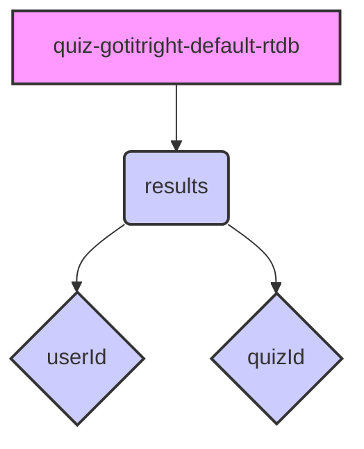

# Firebase Data Structure

# Explanation

- quiz-gotitright-default-rtdb is the root of your database, the top-level node.
- results is a node directly under the root. This is where you're storing your quiz result data.
- userId and quizId are properties that you have configured the database to index on for faster querying.