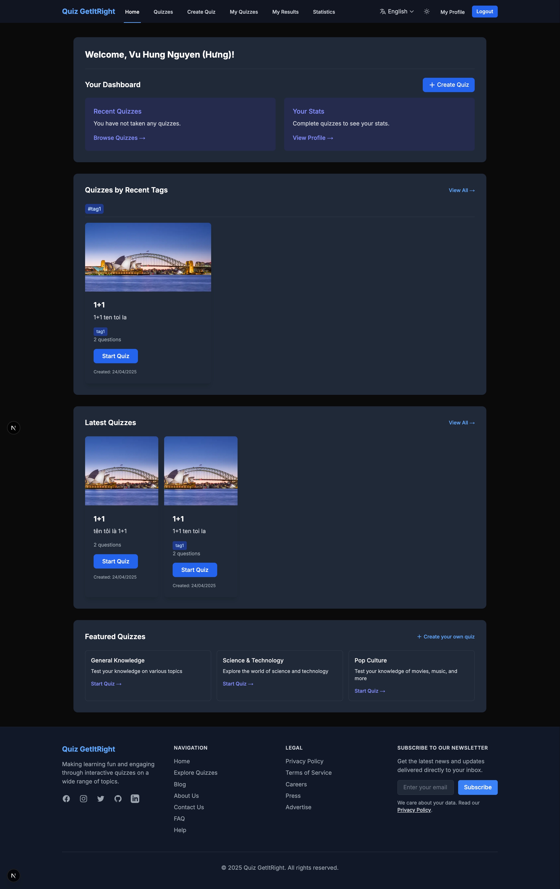

# Quiz Game

A modern, interactive quiz application that allows users to create, share, and take quizzes on various topics. The platform features user authentication, multilingual support, statistics tracking, and a responsive design for an optimal experience across devices.



## Live Demo

Visit the live demo: [Quiz Game Demo](https://quiz-gotitright.vercel.app/en)

## GitHub Repository

[https://github.com/username/quiz-game](https://github.com/vuhung16au/viber-coding/tree/main/QuizGame)

## Technology Stack

- **Frontend**: Next.js 13+ (App Router), React, Tailwind CSS
- **Backend**: Firebase (Authentication, Firebase Realtime Database, Gemini API)
- **State Management**: React Context API
- **Internationalization**: Custom i18n implementation
- **Styling**: Tailwind CSS with custom theming
- **Deployment**: Vercel

## Getting Started

### Prerequisites

- Node.js 18.x or higher
- npm or yarn package manager
- Firebase account

### Installation

1. Clone the repository:
   ```bash
   git clone https://github.com/vuhung16au/viber-coding/
   cd QuizGame
   ```

2. Install dependencies:
   ```bash
   npm install
   # or
   yarn
   ```

3. Set up environment variables:
   Create a `.env.local` file in the root directory with the following variables:
   ```
   NEXT_PUBLIC_FIREBASE_API_KEY=your_api_key
   NEXT_PUBLIC_FIREBASE_AUTH_DOMAIN=your_auth_domain
   NEXT_PUBLIC_FIREBASE_PROJECT_ID=your_project_id
   NEXT_PUBLIC_FIREBASE_STORAGE_BUCKET=your_storage_bucket
   NEXT_PUBLIC_FIREBASE_MESSAGING_SENDER_ID=your_messaging_sender_id
   NEXT_PUBLIC_FIREBASE_APP_ID=your_app_id
   NEXT_PUBLIC_GEMINI_API_KEY=your_gemini_api_key
   NEXT_PUBLIC_ADMIN_EMAIL=your_admin_email
   ```

4. Run the development server:
   ```bash
   npm run dev
   # or
   yarn dev
   ```

5. Open [http://localhost:3000](http://localhost:3000) in your browser to see the application.

## Deployment

### Local Deployment

Follow the Getting Started instructions above to run the application locally.

### Vercel Deployment

1. Push your code to a GitHub repository.
2. Connect your GitHub account from Vercel.
3. Create a new project on Vercel and select your repository.
4. Configure environment variables in the Vercel dashboard using the same keys as in `.env.local`.
5. Deploy the project on Vercel.

## Features

- User authentication (sign up, login, profile management)
- Quiz creation with various question types
- AI-powered quiz generation using Gemini API
- Multi-language support
- Real-time statistics and leaderboards
- Responsive design for all devices
- Dark/light theme toggle

## AI-Powered Quiz Creation

Quiz GetItRight includes a powerful AI quiz generation feature powered by Google's Gemini API. To create quizzes using AI:

1. Navigate to the Create Quiz page
2. Enter a description for your quiz (e.g., "Why is the sky blue?" or "JavaScript basics")
3. Check the "Use AI to create quizzes" checkbox
4. Click the "Create Quiz with AI" button
5. Wait a few seconds while Gemini generates high-quality multiple-choice questions
6. Review the generated questions and make any desired edits
7. Submit the form to create your quiz

The AI will create 10 multiple-choice questions with four options each based on your description. You can add more questions manually or regenerate if needed.

## Security Considerations

To protect your Firebase keys and sensitive information:

1. **Environment Variables**: Always use environment variables for Firebase configuration. Never commit these values directly to your codebase.
2. **Firebase Rules**: Set up Firebase security rules to restrict access to your database. Ensure that only authenticated users can read/write data.
## License

This project is licensed under the MIT License - see the [LICENSE.md](LICENSE.md) file for details.
